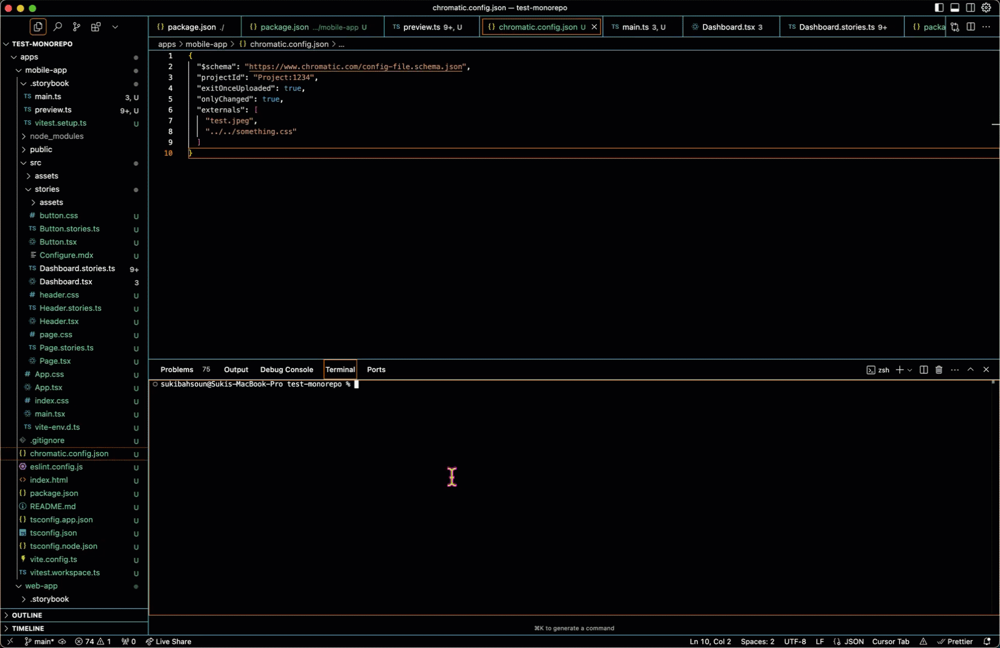

# TurboSnap Helper

TurboSnap Helper is a CLI utility that assists with properly configuring TurboSnap for Chromatic.

Start by running the utility in the root of your _repository_. The utility will help you locate projects for individual configuration.



Why run from the root of your repository and not the root of your project?
**Monorepos!**

By running from the root of your repository, the utility can detect multiple projects and set configuration to work as expected in monorepo setups. This gives the utility the option to search the entire repo for assets, not just the base directory.

## Usage

```sh
npx @chromatic-com/turbosnap-helper
```

The utility has three modes:

-   `init` (default)
-   `analyze`
-   `preview`

### `init` mode (config helper)

When you initiate the utility, it will run the configuration helper. The utility has been updated to search for Storybook projects, so it works in a monorepo and can be ran from the root of the repository.

After a project is selected, you'll be asked whether you'd like to see your config directories or want guided help. Choose the `Help me create` option to have your existing config file updated, or a new file created. From there, the config helper will:

-   create/update the `chromatic.config.json` file with confirmed directories
    -   for new config files, it'll prompt for the project ID
-   search the repo for static assets
-   prompt whether you'd like to add the assets from repo root, project root, or both
-   review assets before adding to modify
-   add individual or glob patterns to `externals`
-   if an existing config file has `externals` paths, the utility will only remove them if they match a pattern being added
-   any existing properties will still be listed in your config file
-   if your config file is missing `onlyChanged` or the schema, the utility will add them both
-   search your project's `package.json` for a Chromatic script
    -   if none exists, it'll ask if you'd like one created that has your config file path listed
    -   if one already exists and doesn't have the config file option, it'll ask if you'd like to add it
    -   if it already exists and there's a mismatch in the paths (ex. `chromatic --config-file 'chromatic.config.json'` in the script but the file is saved to `configs/chromatic.config.json`), the CLI will display this and prompt you to consider updating the script

### `analyze` mode (analyze imports for files)

Using the `analyze` mode, the utility will search your project for any story files and corresponding component files, and provide a summary in the CLI of files that contain dymanic imports.

For story files, these are important to note since they can cause unnecessary rebuilds. In component files, they can lead to regressions not being caught by TurboSnap. Use `analyze` to help ensure your story and component files have optimized imports.

### `preview` mode (analyze the preview file)

If there's a mode to run besides `init`, it's `preview`! Your preview file is like a shared kitchen. If someone dumps salt in the sugar, everyone's cookies are going to taste a bit off. Since this file has such a huge impact on your testing, run this mode to help analyze whether there's optimization you can do to improve your TurboSnap builds.

Running the `preview` mode will:

-   detect if you're using a monorepo
-   warn you if your import count is high
-   print out shared wrappers/themes
-   print out any dynamic imports

No one wants to wash all the dishes if they only used one cup, right? By keeping an efficient preview file, you'll help ensure you're only retesting when actual changes have impacted your stories.


